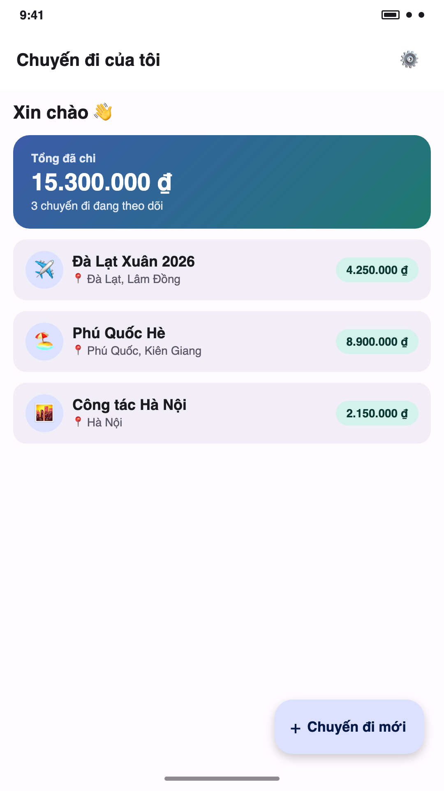
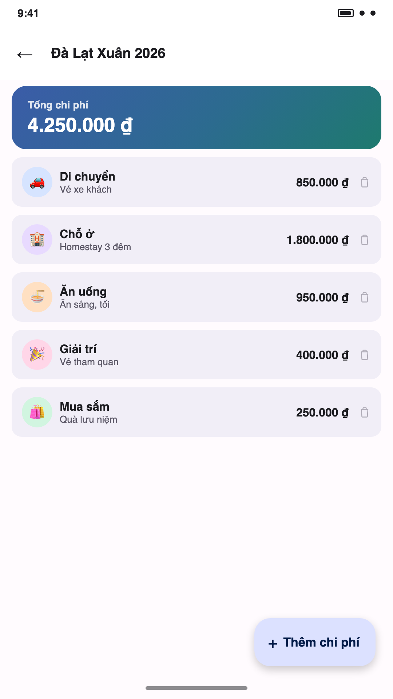
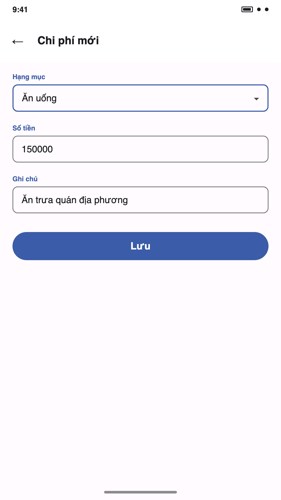
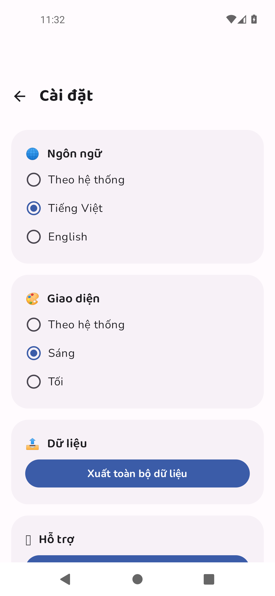

<p align="center">
  
</p>

<h1 align="center">Cost Of Trips — Chi Phí Chuyến Đi</h1>

<p align="center">
  Ứng dụng Android thuần (Kotlin + Jetpack Compose) ghi lại chi phí của từng chuyến đi.<br/>
  Không tài khoản, không quảng cáo, không kết nối mạng — dữ liệu chỉ nằm trên máy của bạn.
</p>

<p align="center">
  <a href="https://github.com/nhockool1002/cost-of-trips/releases/latest"></a>
  <a href="https://github.com/nhockool1002/cost-of-trips/actions/workflows/release.yml"></a>
  
  
  
</p>

<p align="center">
  
</p>

## Giới thiệu

**Cost Of Trips** giúp bạn lên kế hoạch và theo dõi chi phí cho mọi chuyến đi — từ những chuyến phượt cuối tuần đến công tác dài ngày. Ghi từng khoản chi theo hạng mục, xem tổng quan chi tiêu ngay trên màn hình chính, và xuất dữ liệu bất cứ lúc nào. Toàn bộ xử lý diễn ra ngay trên điện thoại của bạn — không máy chủ, không theo dõi, không quảng cáo.

Thực hiện bởi **NhutNguyen © 2026**.

## Ảnh chụp màn hình

<p align="center">
  
  
  
  
  
</p>

## Tính năng

- 🧳 Tạo chuyến đi, theo dõi tổng chi phí ngay trên trang chủ
- 💸 Ghi chi phí theo 6 hạng mục: 🚗 di chuyển · 🏨 chỗ ở · 🍜 ăn uống · 🎉 giải trí · 🛍️ mua sắm · 📦 khác
- 📤 Xuất toàn bộ dữ liệu ra file JSON trong thư mục Downloads
- 🌐 Đa ngôn ngữ: Theo hệ thống / Tiếng Việt / English
- 🌗 Giao diện Sáng / Tối / Theo hệ thống
- 🔒 Không tài khoản, không Internet — dữ liệu chỉ lưu trên thiết bị

## Công nghệ

- Kotlin + Jetpack Compose (Material 3)
- Room (SQLite) cho lưu trữ cục bộ
- DataStore Preferences cho cài đặt giao diện
- Navigation Compose
- AndroidX SplashScreen cho màn hình khởi động
- Phông chữ Baloo 2 & Nunito (Google Fonts, SIL Open Font License)
- R8 + resource shrinking cho bản release

## Build

Yêu cầu Android SDK (compileSdk 35) và JDK 17.

```bash
./gradlew assembleDebug
```

APK debug sẽ nằm ở `app/build/outputs/apk/debug/app-debug.apk`.

Mỗi khi một [GitHub Release](https://github.com/nhockool1002/cost-of-trips/releases) được publish, GitHub Actions sẽ tự động build và đính kèm file `.apk` (cài trực tiếp) và `.aab` (nộp Google Play).

## Trang giới thiệu & chính sách riêng tư

- Landing page: [`docs/index.html`](docs/index.html)
- Chính sách riêng tư: [`docs/privacy.html`](docs/privacy.html)

---

<p align="center">Made with ❤️ by <strong>NhutNguyen</strong> © 2026</p>
